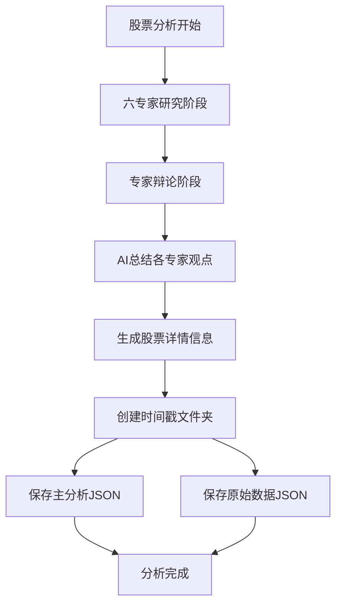

## 用户需求

用户要求对现有的FinGenius股票分析系统进行重大重构，主要包括：

1. **删除HTML生成功能**：完全移除所有HTML报告生成相关的代码和逻辑
2. **增强AI总结功能**：在辩论结束后，使用AI对六位专家的辩论内容进行深度总结，生成结构化的分析结论
3. **重构数据输出格式**：将分析结果以JSON格式保存，包含专家分析结论、股票详情信息和投票结果
4. **优化数据存储结构**：将原始股票数据与分析结果分离存储，按时间戳创建文件夹统一管理
5. **保持核心分析流程**：维持现有的六专家研究阶段和辩论投票机制不变

## 核心功能

- **六专家深度分析**：情感分析、风险控制、游资分析、技术分析、筹码分析、大单异动分析
- **多轮专家辩论**：保持现有的辩论环境和投票机制
- **AI智能总结**：对每个专家的辩论内容进行结构化总结，包含分析结论、关键论点、标签和数据来源
- **结构化数据输出**：生成包含股票基本信息、专家投票结果、分析结论的完整JSON报告
- **分离式数据存储**：原始股票数据与分析结果分开保存，便于数据管理和复用

## 预期效果

系统将生成两类JSON文件：主分析报告（包含专家总结、股票详情、投票结果）和原始数据文件（API获取的股票基础信息），所有文件按时间戳组织在统一文件夹中，便于管理和追溯。

## 技术栈选择

基于现有项目架构，继续使用：

- **后端框架**：Python + AsyncIO
- **数据处理**：Pandas + Pydantic
- **AI集成**：现有的LLM调用框架（支持OpenAI/Ollama）
- **数据存储**：JSON文件系统
- **工具系统**：现有的BaseTool架构

## 实施方案

### 核心策略

采用**渐进式重构**方式，保持现有核心分析流程不变，重点改造数据输出和存储逻辑。通过新增AI总结工具和重构报告管理器来实现需求。

### 关键技术决策

1. **AI总结实现**：基于现有的`CreateChatCompletion`工具创建专门的专家总结工具，对每个专家的辩论内容进行结构化分析
2. **数据分离策略**：扩展`report_manager`支持原始数据与分析结果的分离存储
3. **文件组织方式**：按`YYYYMMDD_HHMMSS`时间戳创建文件夹，统一管理单次分析的所有输出文件
4. **向后兼容性**：保留现有的分析数据结构，确保不影响其他模块的正常运行

### 架构设计

#### 数据流设计



#### 新增组件架构

- **ExpertSummaryTool**：专家观点AI总结工具
- **AnalysisReportGenerator**：分析报告生成器
- **TimestampedReportManager**：基于时间戳的报告管理器

### 实施细节

#### 性能优化

- **并行处理**：AI总结可以与股票信息获取并行进行
- **缓存机制**：复用现有的股票基础信息缓存
- **内存管理**：及时清理大型数据结构，避免内存泄漏

#### 错误处理

- **降级策略**：AI总结失败时使用原始辩论内容作为备选
- **数据完整性**：确保即使部分组件失败，核心分析结果仍能正常保存
- **日志记录**：详细记录每个步骤的执行状态，便于问题排查

#### 向后兼容

- **保留现有接口**：`_generate_reports`方法保持相同的调用方式
- **数据结构兼容**：新的JSON格式包含所有原有数据字段
- **配置可控**：通过配置开关控制新旧功能的启用

## 目录结构

### 新增文件

```
src/
├── tool/
│   └── expert_summary.py          # [NEW] 专家观点AI总结工具，基于CreateChatCompletion实现结构化总结
├── utils/
│   └── analysis_report_generator.py # [NEW] 分析报告生成器，整合专家总结、股票信息、投票结果
└── prompt/
    └── expert_summary.py          # [NEW] 专家总结的提示词模板
```

### 修改文件

```
main.py                            # [MODIFY] 重构_generate_reports方法，移除HTML生成，添加AI总结流程
src/utils/report_manager.py        # [MODIFY] 添加时间戳文件夹管理和数据分离存储功能
src/agent/report.py               # [MODIFY] 移除HTML工具依赖，或完全删除此文件
```

### 删除文件

```
src/tool/create_html.py           # [DELETE] HTML生成工具（982行）
src/prompt/create_html.py         # [DELETE] HTML生成提示词（795行）
```

## 关键代码结构

### 专家总结数据模型

```python
class ExpertSummary(BaseModel):
    expert_name: str
    analysis_conclusion: str
    one_sentence_summary: str
    key_arguments: List[str]
    key_tags: List[str]
    data_sources: List[str]
```

### 分析报告数据结构

```python
class AnalysisReport(BaseModel):
    stock_info: StockBasicInfo
    expert_summaries: Dict[str, ExpertSummary]
    voting_results: VotingResults
    debate_summary: DebateSummary
    timestamp: str
    metadata: Dict[str, Any]
```

## 推荐的Agent扩展

### MCP

- **knot**
- 目的：在AI总结过程中，如果需要补充股票相关的专业知识或行业信息，可以通过knot MCP工具查询Tushare知识库
- 预期结果：为专家总结提供更准确的行业背景信息和数据解释，提升总结质量和专业性